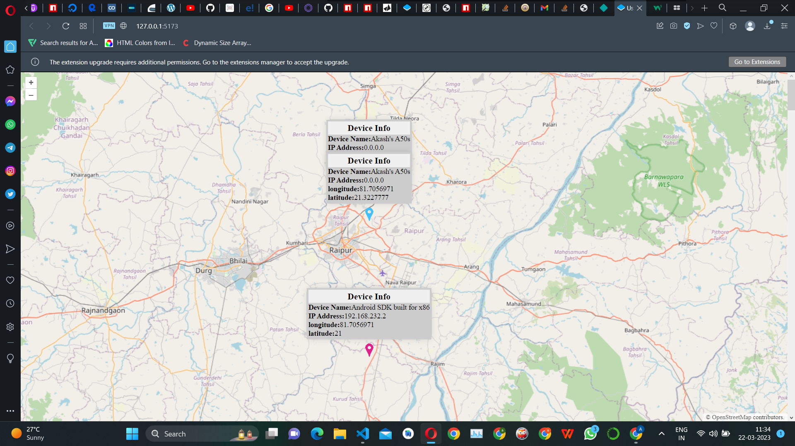

# TrackLocation Web app

This app is basically to show the Location of Mobile devices.

In this app we use OpenLayer

To get started, run the following (requires Node 14+):

    npx create-ol-app my-app --template vite

Then change into your new `my-app` directory and start a development server (available at http://localhost:5173):

    cd my-app
    npm start

To generate a build ready for production:

    npm run build

Then deploy the contents of the `dist` directory to your server.  You can also run `npm run serve` to serve the results of the `dist` directory for preview.
ScreenShots
